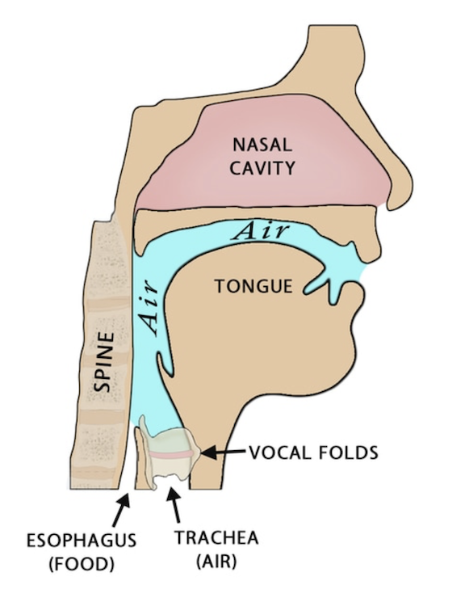

Language is a fundamental part of human culture, shaping our identities, traditions, and ways of thinking. With over 7,000 languages spoken globally, it's concerning that nearly half are endangered <a href="https://www.ethnologue.com" style="text-decoration: none;" target="_blank" title="Visit Ethnologue for more info">[1]</a>.

In the past decade, speech technologies integrated into smartphones and other personal devices have become essential to our daily lives. However, these systems only support a handful of languages. As AI-driven speech systems continue to evolve, the reliance on these limited language systems could deepen the digital divide, further marginalizing underrepresented languages. This is especially concerning for younger generations in minority communities. While immersed in technology from an early age, children may primarily interact with dominant languages, even as families work to preserve their native tongues.

Thus, through this blog, I would like to:
1. Offer a tutorial on the fundamentals of speech technology for those interested
2. Explore recent advancements in speech technology research for low-resource languages
3. Share valuable resources and highlight specific implementations in my native language, Uyghur

By addressing these topics, I hope to inspire further efforts in preserving linguistic diversity and advancing speech technologies that can support a wider range of languages.

## Table of Contents
1. [Speech Technology Fundamentals](#section-1)
2. [Low-Resource Language Speech Research](#section-2)
3. [Uyghur Speech Technology](#section-3)
4. [References](#references)

## Speech Technology Fundamentals

Speech technology has evolved significantly in the past decade, enabling devices to understand and generate human speech. To fully appreciate these advancements, it’s important to understand the fundamentals of speech systems.

### Phonetics Basics
Phonetics studies the sounds in human speech, vital for converting between written text and spoken language.

A **grapheme** is the smallest unit of a writing system that represents a sound or a meaningful unit of language. For example, in English, the letter “b” is a grapheme representing the /b/ sound. 

A **phoneme** is the smallest unit of sound in a language that can distinguish one word from another. Phonemes are auditory representations, not written forms like graphemes, and can vary depending on the speaker’s accent, language, and context. For example, in English, /p/ and /b/ are distinct phonemes because changing them alters the meaning of a word, such as changing “pat” (/p/) to “bat” (/b/). The **International Phonetic Alphabet (IPA)** is a standardized system of symbols that represents phonemes across languages.

With graphemes and phonemes, we can create **grapheme-to-phoneme (G2P) mapping**, which converts written text into its corresponding phonetic representation, crucial for speech recognition and synthesis. 

Python libraries like [epitran](https://github.com/dmort27/epitran) can be used to transliterate text to IPA phoneme for many languages, while libraries like [g2p-en](https://pypi.org/project/g2p-en/) and [g2p-seq2seq](https://github.com/cmusphinx/g2p-seq2seq) has also been developed for G2P mapping in multiple dominate languages. 

*The 44 phonemes of Standard English based on [International Phonetic Alphabet](https://en.wikipedia.org/wiki/International_Phonetic_Alphabet).*

### Acoustics Basics
Acoustics studies how waves travel through media like air or water, crucial for understanding human speech and building audio processing systems.

Speech production begins with our vocal folds creating a basic sound when air passes through them. However, before the sound exits the mouth, it travels through the vocal tract (throat, mouth, and nose) which shapes and modifies it. These modifications produce **formants**, which are resonant frequencies essential for distinguishing sounds in a language, especially vowels <a href="http://www.voicescienceworks.org/harmonics-vs-formants.html" style="text-decoration: none;" target="_blank" title="Visit Voice Science Works for more info">[2]</a>.

To analyze these acoustic properties, we use tools like the spectrogram. A **spectrogram** is a visual representation of the spectrum of frequencies in a sound signal over time. It shows how the frequency content of an audio signal changes, allowing us to visualize speech as a sequence of sounds. The **Mel spectrogram** is a variation that uses the Mel scale, which aligns more closely with human hearing. The Mel scale compresses high-frequency components, where our hearing is less sensitive, and expands low-frequency components, where we are more sensitive.<a href="https://huggingface.co/learn/audio-course/en/chapter1/audio_data" style="text-decoration: none;" target="_blank" title="Visit this HuggingFace course for more info">[3]</a>. Mel spectrograms are widely used as input features for speech models.

The effectiveness of spectrograms depends on the **sampling rate**, the number of times per second an audio signal is sampled during digitization. A higher sampling rate provides more detail, capturing a clearer representation of the sound. However, higher sampling rates also require more computational power and storageIn speech processing, **16 kHz** is commonly used, as it captures frequencies up to 8 kHz, covering most of the important information in human speech. For music, a higher sampling rate like **44.1 kHz** is standard, capturing frequencies up to 22.05 kHz, the upper limit of human hearing.

Libraries like [ibrosa](https://librosa.org/doc/latest/index.html) and [pydub](https://github.com/jiaaro/pydub) simplify tasks such as generating spectrograms, adjusting sampling rates, and feature extraction, aiding robust speech processing.

*Comparison of Mel spectrograms for an audio clip saying "Hello World" at 16 kHz and 44.1 kHz sampling rates. Higher sampling rates capture more detailed information, as seen in the richer frequency representation at 44.1 kHz.*

## Low-Resource Language Speech Research

ABC

## Uyghur Speech Technology

ABC

## Reference

You can also embed a lot of stuff, for example from YouTube, using the `embed.html` include.