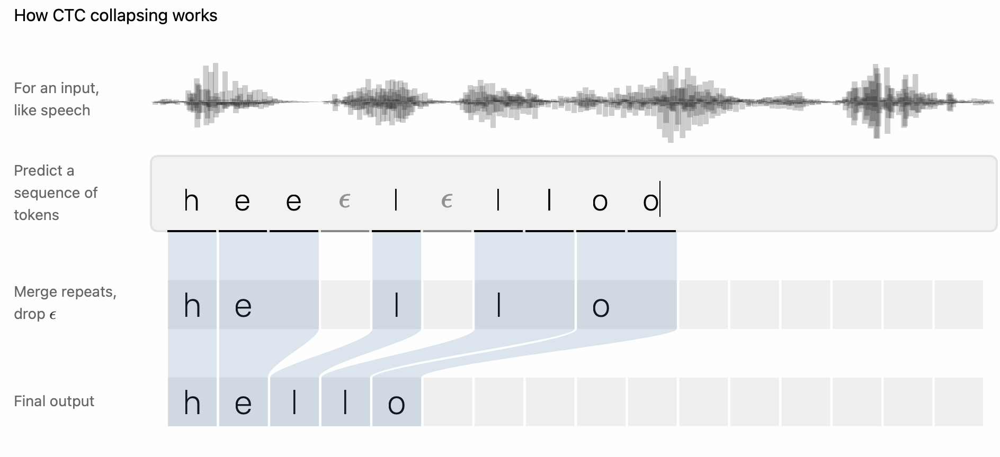
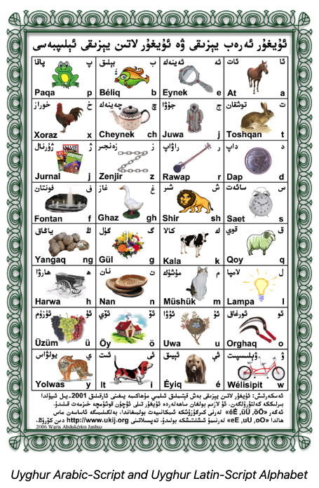
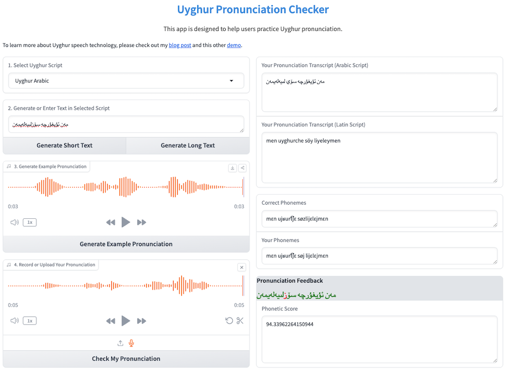

Language is a cornerstone of human culture, shaping our identities, traditions, and ways of thinking. With over 7,000 languages spoken globally, it's alarming that nearly half are endangered<a href="https://www.ethnologue.com" style="text-decoration: none;" target="_blank" title="Visit Ethnologue for more info">1</a>. When a language disappears, its speakers lose a vital connection to their heritage and history. The world also loses unique perspectives, cultural knowledge, and valuable insights into human behavior and ways of life.

In today's digital age, speech technologies integrated into smartphones and other personal devices have become essential to our daily lives. However, these systems only support a handful of languages. As AI continues to advance, the reliance on speech technologies may grow, further deepening the digital divide and marginalizing underrepresented languages. This is especially concerning for younger generations in minority communities. While immersed in technology from an early age, children may primarily interact with dominant languages, even as families work to preserve their native tongues.

Thus, through this article, I would like to:
1. Offer a tutorial on the fundamentals of speech technology for those interested
2. Explore recent advancements in speech technology research for low-resource languages
3. Share some valuable resources and implementations for my native language, Uyghur

By addressing these topics, I hope to inspire further efforts in preserving linguistic diversity and advancing speech technologies that can support a wider range of languages.

# Table of Contents
1. [Speech Technology Fundamentals](#speech-technology-fundamentals)
    1. [Phonetics Basics](#phonetics-basics)
    2. [Acoustics Basics](#acoustics-basics)
    3. [Speech Applications](#speech-applications)
    4. [Notable Architectures](#notable-architectures)
2. [Low-Resource Language Speech Research](#low-resource-language-speech-research) 
3. [Uyghur Speech Technology](#uyghur-speech-technology)
    1. [Brief History of Uyghur Language and Speech Technology](#brief-history-of-uyghur-language-and-speech-technology)
    2. [Available Uyghur Speech Datasets](#available-uyghur-speech-datasets)
    3. [Available Uyghur Speech Models](#available-uyghur-speech-models)
    4. [Additional Tools](#additional-tools)
4. [References](#references)

# 1. Speech Technology Fundamentals 
Speech technology has evolved significantly in the past decade, enabling devices to recognize and generate human speech. To fully appreciate these advancements, it’s important to understand the fundamentals of speech systems.

## 1.1 Phonetics Basics 
Phonetics studies the sounds in human speech, vital for converting between written text and spoken language.

A **grapheme** is the smallest unit of a writing system that represents a sound or a meaningful unit of language. For example, in English, the letter “b” is a grapheme representing the /b/ sound. 

A **phoneme** is the smallest unit of sound in a language that can distinguish one word from another. Phonemes are auditory representations, not written forms like graphemes, and can vary depending on the speaker’s accent, language, and context. For example, in English, /p/ and /b/ are distinct phonemes because changing them alters the meaning of a word, such as changing “pat” (/p/) to “bat” (/b/). The **International Phonetic Alphabet (IPA)** is a standardized system of symbols that represents phonemes across languages.

With graphemes and phonemes, we can create **grapheme-to-phoneme (G2P) mapping**, which converts written text into its corresponding phonetic representation, crucial for speech recognition and synthesis. 

Python libraries like [epitran](https://github.com/dmort27/epitran) can be used to transliterate text to IPA phoneme for many languages, while libraries like [g2p-en](https://pypi.org/project/g2p-en/) and [g2p-seq2seq](https://github.com/cmusphinx/g2p-seq2seq) have also been developed for G2P mapping in multiple dominant languages. 

*The 44 phonemes of Standard English based on [International Phonetic Alphabet](https://en.wikipedia.org/wiki/International_Phonetic_Alphabet).*

## 1.2 Acoustics Basics 

Acoustics studies how waves travel through media like air or water, crucial for understanding human speech and building audio processing systems.

Speech production begins with our vocal folds creating a basic sound when air passes through them. However, before the sound exits the mouth, it travels through the vocal tract (throat, mouth, and nose), which shapes and modifies it. These modifications produce **formants**—resonant frequencies essential for distinguishing sounds in a language, especially vowels<a href="http://www.voicescienceworks.org/harmonics-vs-formants.html" style="text-decoration: none;" target="_blank" title="Visit Voice Science Works for more info">2</a>.

To analyze these acoustic properties, we use methods like the spectrogram. A **spectrogram** is a visual representation of the frequency spectrum in a sound signal over time. It plots how the frequency content of an audio signal changes, allowing us to visualize speech as a sequence of sounds. The **Mel spectrogram** is a variation that uses the Mel scale, which aligns more closely with human hearing. The Mel scale compresses high-frequency components, where our hearing is less sensitive, and expands low-frequency components, where we are more sensitive. Mel spectrograms are widely used as input features for speech models<a href="https://huggingface.co/learn/audio-course/en/chapter1/audio_data" style="text-decoration: none;" target="_blank" title="Check out this HuggingFace course to learn more">3</a>.

The effectiveness of spectrograms depends on the **sampling rate**—the number of times per second an audio signal is sampled during digitization. A higher sampling rate provides more detail, capturing a clearer representation of the sound. However, higher sampling rates also require more computational power and storage. For speech processing, **16 kHz** is commonly used, as it captures frequencies up to 8 kHz, covering most of the important information in human speech. For music, a higher sampling rate like **44.1 kHz** is standard, capturing frequencies up to 22.05 kHz, the upper limit of human hearing.

Libraries like [librosa](https://librosa.org/doc/latest/index.html) and [pydub](https://github.com/jiaaro/pydub) simplify tasks such as generating spectrograms, adjusting sampling rates, and feature extraction, aiding robust speech processing.

*Comparison of Mel spectrograms for an audio clip saying "Hello World" at 16 kHz and 44.1 kHz sampling rates. Higher sampling rates capture more detailed information, as seen in the richer frequency representation at 44.1 kHz.*

## 1.3 Speech Applications 

Speech technology encompasses a broad range of applications that support various tasks. Among these, Automatic Speech Recognition and Speech Synthesis are two of the most influential and widely used.

**Automatic Speech Recognition (ASR)**, also known as **Speech-to-Text (SST)**, converts human speech into written text. ASR forms the foundation of numerous technologies, including virtual assistants, transcription services, real-time translation systems, and accessibility tools. To build a reliable ASR system, large datasets of transcribed speech, covering diverse speech patterns, accents, and languages, are essential. Its performance is typically evaluated using metrics like **Word Error Rate (WER)** or **Character Error Rate (CER)** on datasets such as [FLEURS](https://huggingface.co/datasets/google/fleurs) (a widely recognized benchmark for multilingual ASR, covering 102 languages)<a href="https://huggingface.co/learn/audio-course/en/chapter1/audio_data" style="text-decoration: none;" target="_blank" title="Check out this HuggingFace course to learn more">4</a>.

**Speech Synthesis**, also known as **Text-to-Speech (TTS)**, converts written text into natural-sounding speech.  It is used in virtual assistants, audiobooks, language learning platforms, and tools for visually impaired users. High-quality TTS models typically need labeled audio data from a single speaker to produce realistic voices. Evaluation metrics include subjective measures like **Mean Opinion Score (MOS)** and objective metrics like **Word Error Rate (WER)** or **Character Error Rate (CER)** to assess the naturalness and accuracy of synthesized speech.

Some other common speech technology tasks include:
* **Audio Classification**: Categorizing audio clips into distinct classes.
* **Language Identification**: Identifying the language spoken in an audio clip.
* **Speaker Diarization**: Identifying the speaker at any given moment in an audio clip.
* **Keyword Detection**: Detecting specific words or phrases in continuous speech, often used for wake-word detection in voice assistants.

## 1.4 Notable Architectures 

Over the years, various architectures have been proposed for different speech tasks. Here, I will discuss two popular types.

### 1.4.1 Traditional Approach: Hidden Markov Models (HMMs)
Hidden Markov Models (HMMs) were the foundation of many early ASR and TTS systems before the rise of deep learning-based models. HMMs model speech as sequences of phonemes, with probabilities for transitions and observations.

To better understand how HMMs work, let’s recognize the word “hello” from a speech signal using HMMs. Here’s the setup:
* **Hidden States (Phonetic Features)**: represent the phonemes. (e.g., /h/, /e/, /l/, /o/).
* **Observations (Acoustic Features)**: the actual audio features that we can measure, such as frequency or amplitude. (e.g., we observe the distinct frequency for /e/).
* **Transition Probabilities**: the likelihood of moving between states (e.g., 0.7 for /h/ → /e/).
* **Emission Probabilities**: the likelihood of audio features given a current state. (e.g., 0.8 for frequency around 1800 Hz given /e/).

Now to walk through the recognizing process: 
1. We start with an initial probability for the first state. For example, we may set the probability of starting with the phoneme /h/ is 1 (since we know the word starts with “h”).
2. The model then transitions from state to state based on the transition probabilities. For example, after hearing /h/, it is the most likely to transition to /e/.
3. For each state, we also generate an observation based on the emission probabilities. For example, in state /h/, the observation may be audio signal for a burst of air.
4. Finally, after processing the sequence of states and their corresponding observations, the model uses the transition and emission probabilities to determine the most likely sequence of phonemes that led to the observed acoustic features, which may led to /h/, /e/, /l/, /l/, /o/, or “hello.”

### 1.4.2 Modern Approach: End-to-End (E2E)
With the rise of deep learning methods in ML since the 2010s, researchers have achieved significant success with deep learning-based speech models, particularly End-to-End (E2E) architectures. E2E models eliminate the need for hand-crafted features or separated language and acoustic models by integrating both into a single neural network. Two common E2E structures are based on Connectionist Temporal Classification (CTC) loss functions and Sequence-to-Sequence (Seq2Seq) modeling. Below is how the word “hello” can be recognized using each approach:

**CTC (Connectionist Temporal Classification)**: Encoder-only structure<a href="https://distill.pub/2017/ctc/" style="text-decoration: none;" target="_blank" title="Check out this tutorial to learn more">5</a>
1. **Encoder**: The model processes the audio, breaking it into small frames (e.g., 20 milliseconds) and creates a hidden state for each frame.
2. **Vocabulary**: For each hidden state, the model predicts a label, such as a character or phoneme. (e.g., “HEE”, is predicted from the first 3 frames)
3. **Blank Token**: Since the model doesn’t know the exact timing of words, it may also use a blank token (_) to skip over uncertain regions of the audio.
4. **Post-processing**: After the model makes predictions, repeated labels and blanks are cleaned up (e.g., “HEE_L_LL_OO” becomes “HELLO”).

Popular CTC-based ASR Models: [Wav2Vec](https://huggingface.co/docs/transformers/en/model_doc/wav2vec2), [HuBERT](https://huggingface.co/docs/transformers/en/model_doc/hubert), [M-CTC-T](https://huggingface.co/docs/transformers/en/model_doc/mctct).

*Demo of how CTC algorithm recognizes "hello" from input audio by [Awni Hannun](https://distill.pub/2017/ctc/)*

**Seq2Seq (Sequence-to-Sequence)**: Encoder-Decoder structure<a href="https://huggingface.co/learn/audio-course/en/chapter3/seq2seq" style="text-decoration: none;" target="_blank" title="Check out this tutorial to learn more">6</a>
1. **Encoder**: The model listens to an audio clip (e.g., “hello”) and transforms it into a sequence of features (e.g., mel spectrogram). The encoder processes these features to capture key information about the speech.
2. **Decoder**: The decoder uses the encoded information to generate the output sequence. It starts with a “start” token and predicts the next word or character (e.g., “h” for “hello”), adding each prediction to the growing output.
3. **Cross-Attention**: The decoder uses the encoder’s hidden states to focus on relevant parts of the input when predicting subsequent tokens.
4. **Autoregressive Generation**: The decoder generates one token at a time, using the previous token to predict the next. For example, after predicting “h,” it uses that to predict “e,” and so on, until it finishes with "hello."

Popular Seq2Seq-based ASR models: [Whisper](https://openai.com/index/whisper/)

Popular Seq2Seq-based TTS models: [SpeechT5](https://github.com/microsoft/SpeechT5), [Tacotron](https://pytorch.org/hub/nvidia_deeplearningexamples_tacotron2/)

*The encoder-decoder structure shown in [OpenAI Whisper blog](https://openai.com/index/whisper/)*

# 2. Low-Resource Language Speech Research 

**Low-resource languages** are those with limited linguistic data resources, such as annotated text corpora or speech recordings, which are essential for developping robust speech and language models. In recent years, efforts by various research groups and organizations have led to some significant progress in data creation and model development for low-resource languages. Below are a few notable examples:

### Common Voice (2017)
Common Voice is a crowdsourcing project initiated by Mozilla to create a diverse **open-source dataset** of human voice recordings. It encourages volunteers to contribute their voices in various languages, including many low-resource ones. Anyone can record themselves reading texts or validate recordings submitted by others in available languages. The platform allows individuals to request new languages and assist in making them available. This community-driven approach has been crucial in expanding and diversifying the dataset. 

The project is continually expanding, with new releases every three months. The latest release, **Common Voice Corpus 20.0**, includes over **22,000 hours** of validated recordings across **130+ languages**<a href="https://commonvoice.mozilla.org" style="text-decoration: none;" target="_blank" title="Visit Mozilla Common Voice for more info">7</a>.

### CMU Wilderness (2019) 

The CMU Wilderness Multilingual Speech dataset, developed by researchers from Carnegie Mellon University, provides aligned sentences and audio for over **700 languages**, focusing primarily on low-resource languages. The dataset was created by extracting audio from **New Testament** recordings and includes, on average, **20 hours of data per language**. Importantly, the data creation algorithms were **open-sourced**, enabling others to recreate the datasets<a href="https://github.com/festvox/datasets-CMU_Wilderness" style="text-decoration: none;" target="_blank" title="Visit CMU Wilderness Github Repo for more info">8</a>. This extensive dataset has enabled researchers to investigate the effectiveness of various pre-trained speech models on low-resource languages. 

### ASR2K (2022)

The ASR2K project, also from Carnegie Mellon University, aimed to improve **automatic speech recognition** for **1,909 languages** by leveraging transfer learning and multilingual models. Their approach involves mapping the output of multilingual models trained on high-resource languages to the appropriate phonemes for the target language. ASR2K represents the first attempt to build a speech recognition pipeline for thousands of languages without requiring audio data<a href="https://arxiv.org/abs/2209.02842" style="text-decoration: none;" target="_blank" title="Check out the ASR2K paper to learn more">9</a>.

### Meta MMS (2023)

In 2023, Meta introduced its Massively Multilingual Speech (MMS) project, which extended the capabilities of **automatic speech recognition** and **text-to-speech** systems to over **1,100 languages**, and **language identification** to over **4,000 languages**.

The project utilized **Wav2Vec 2.0 models (CTC-based)** trained on datasets created using self-supervised learning and data alignment techniques. These datasets include a labeled dataset (MMS-lab) covering 1,107 languages and an unlabeled dataset (MMS-unlab) covering 3,809 languages, both created from recordings of New Testaments similar to the CMU Wilderness dataset. Meta also **open-sourced** their data alignment algorithms, enabling others to replicate and build upon their work<a href="https://github.com/facebookresearch/fairseq/tree/main/examples/mms" style="text-decoration: none;" target="_blank" title="Visit MMS Github Repo for more info">10</a>.

Meta MMS models outperformed some existing state-of-the-art models, including OpenAI's Whisper, achieving half the word error rate while covering 11 times more languages<a href="https://ai.meta.com/blog/multilingual-model-speech-recognition/" style="text-decoration: none;" target="_blank" title="Check out the MMS blog to learn more">11</a>. These models are not only some of the most comprehensive and high-performing in the field but are also open-sourced, allowing researchers and developers to fine-tune them for specific applications, paving the way for more inclusive and accessible speech technologies worldwide. 

To see examples of fine-tuning these models for specific low-resource languages, continue to the next section.

# 3. Uyghur Speech Technology 

Uyghur, spoken by over 13 million people worldwide—primarily in Central Asia—represents a rich cultural and linguistic heritage. It is closely related to Uzbek, both belonging to the **Karluk** branch of the **Turkic language family**, and shares significant similarities with other Turkic languages like Kazakh, Turkish, etc.

Modern Uyghur has a unique alphabet with **32 letters**, including **8 vowels** and **24 consonants**. The language is primarily written using a modified **Perso-Arabic** script that marks all vowels, setting it apart from other languages that use similar scripts. **Latin** and **Cyrillic** scripts are also used in various contexts, though to a lesser extent. Like many Turkic languages, Uyghur features vowel harmony and agglutination and lacks noun classes or grammatical gender<a href="https://en.wikipedia.org/wiki/Uyghur_language" style="text-decoration: none;" target="_blank" title="Read more about Uyghur language here">12</a>.

Over the years, substantial progress has been made in advancing Uyghur speech technology, driven by efforts from researchers, organizations, and individuals. This overview provides a brief history of these developments, along with references for further learning, as well as available datasets, models, implementation tutorials, and tools I found that may be helpful for those looking to contribute to this field. The ultimate goal is to inspire the creation of more applications aimed at preserving the Uyghur language and potentially offer insights that can benefit other low-resource languages.

## 3.1 Brief History of Uyghur Language and Speech Technology 

* **1994**: The Uyghur alphabet was incorporated into the international Unicode encoding standard[13](#13)
* **1996**: The first Uyghur speech corpus was created, marking the start of Uyghur speech recognition research[14](#14)
* **1998**: The first Uyghur website was established[13](#13)
* **2004**: The first Uyghur search engine was developed[15](#15)
* **2009**: A Uyghur continuous speech recognition system based on Hidden Markov Models (HMM) was developed[16](#16)
* **2014**:  
    * A detailed acoustic feature analysis of Uyghur phonemes was conducted[17](#17) 
    * A study on Uyghur speech retrieval was published[18](#18)
* **2015**: Deep neural networks began to be applied to Uyghur speech recognition[19, ](#19)[20](#20)
* **2016**: Research focused on Uyghur speaker adaptation for speech recognition[21](#21)
* **2017**: The THUYG20, a free Uyghur speech corpus, was released[22](#22)
* **2021**: A state-of-the-art Conformer-CTC Uyghur speech recognition model was introduced[23](#23)
* **2022**: A comprehensive overview of speech recognition techniques for Uyghur, Kazakh, and Kyrgyz was published[24](#24)
* **2023**:  
    * Nazarbayev University released Turkic TTS, including a TTS model for Uyghur[25](#25)
    * Meta released its MMS models, including support for Uyghur ASR, TTS, and language identification[26](#26)

## 3.2 Available Uyghur Speech Datasets 

### THUYG20
The THUYG20 Dataset, published in 2017 by researchers from Tsinghua University and Xinjiang University, is widely recognized as a **benchmark** for Uyghur speech models. It includes **20 hours of training** speech and **1 hour of test** speech from native Uyghur speakers. The dataset also includes supplementary resources such as THUYG20-SRE for speaker recognition and a phoneme dictionary. These datasets can be downloaded directly from [here](https://openslr.org/22).

One limitation of THUYG20, however, is its use of non-standard Uyghur scripts. Thanks to Mr. Gheyret Kenji, the transcriptions are corrected in both Uyghur-Arabic and Uyghur-Latin scripts and can be downloaded from his GitHub [repository](https://github.com/gheyret/thuyg20_scripts).

### M2ASR
The M2ASR project is a large-scale initiative to advance speech recognition technologies for five minority languages: Uyghur, Tibetan, Mongolian, Kazakh, and Kyrgyz. For Uyghur, the project provides **136 hours** of speech data, transcripts, and a pronunciation dictionary. While these resources were publicly released in 2021, access requires emailing the research group for permission: [M2ASR Details](http://index.cslt.org/mediawiki/index.php/ASR-nsfc-data).

### Common Voice
As highlighted earlier, the Common Voice dataset is rapidly expanding across hundreds of languages, thanks to the contributions of volunteers worldwide. Over the past two years, the Uyghur community has made significant strides toward a goal of reaching 1,000 hours of speech data for Uyghur. The latest release, Common Voice Corpus 20.0, now includes over **350 hours** of validated Uyghur audio, making it one of the largest and most diverse collections of Uyghur speech data available. 

To any Uyghur speakers reading this: **please contribute**! By dedicating just a few minutes of your time daily, you can play a vital role in advancing Uyghur speech technology.  It’s also a great way to practice reading Uyghur, especially for those who may not have had the chance to receive formal education in the language. To contribute or download the dataset, please visit [here](https://commonvoice.mozilla.org).

### UQSpeechDataset
The UQSpeechDataset features recordings of a **single speaker** making it highly suitable for Text-to-Speech (TTS) training. Created by Mr. Gheyret Kenji and other Uyghur scholars, this dataset consists of audio translations of the **Noble Quran** in Uyghur, segmented into 10-second clips, with transcripts provided in Uyghur Arabic, Latin, and Cyrillic scripts. This dataset is publicly available in this [repository](https://github.com/gheyret/UQSpeechDataset).

## 3.3 Available Uyghur Speech Models 

Several publicly available Uyghur speech models exist, however, they are typically part of larger models not specifically trained for Uyghur. Thus, I have fine-tuned some these models with the datasets mentioned earlier and released the fine-tuning code in my [GitHub repository](https://github.com/ixxan/ug-speech). These models can be downloaded and used for inference from the links provided in the section below.

Additionally, the results from all the models are demonstrated in my [HuggingFace space](https://huggingface.co/spaces/ixxan/uyghur-speech-models), along with this [Uyghur pronunciation checker app](https://huggingface.co/spaces/ixxan/uyghur-pronunciation-checker) I was able to create using some of them. 

*Demo of a [Uyghur Pronunciation Checker](https://huggingface.co/spaces/ixxan/uyghur-pronunciation-checker) application created using fine-tuned ASR and TTS models*

### TurkicTTS
Released in 2023 by researchers at Nazarbayev University, the TurkicTTS model enables **Text-to-Speech** for Uyghur, among other Turkic languages. Trained on high-quality Kazakh speech data, the model uses the International Phonetic Alphabet (IPA) to phonetically map letters across Turkic languages. The pre-trained TurkicTTS model and resources are publicly available in this [repository](https://github.com/IS2AI/TurkicTTS) for download and inference.

### Meta MMS
As previously mentioned, Meta’s Massively Multilingual Speech project includes models for Uyghur **Automatic Speech Recognition (ASR)**, **Text-to-Speech (TTS)**, and **language identification (LID)** trained from single-speaker biblical recording data. You can try these models in this HuggingFace [demo](https://huggingface.co/spaces/mms-meta/MMS) or use their checkpoints from the following sources: 
* [Meta-MMS-ASR](https://huggingface.co/facebook/mms-1b-all) 
* [Meta-MMS-TTS](https://huggingface.co/facebook/mms-tts-uig-script_arabic) 
* [Meta-MMS-LID](https://huggingface.co/facebook/mms-lid-1024)

To improve the accuracy of these models for Uyghur, I fine-tuned the ASR model using a combination of THUYG20, Common Voice, and UQSpeechDataset (around 74 hours of training speech), and fine-tuned the TTS model using single -speaker UQSpeechDataset. These models are available here:
* [FineTuned-MMS-ASR-Uyghur](https://huggingface.co/ixxan/wav2vec2-large-mms-1b-uyghur-latin)
* [FineTuned-MMS-TTS-Uyghur](https://huggingface.co/ixxan/mms-tts-uig-script_arabic-UQSpeech)

### OpenAI Whisper
While OpenAI’s Whisper model is not available for Uyghur, it is available for Uzbek. As Uzbek is closely related to Uyghur, I fine-tuned the Uzbek whisper-small model using approximately 20 hours of training speech from Uyghur Common Voice and the THUYG20 datasets. The fine-tuned models resulted in a 10.9% CER on Common Voice and 4.9% CER on THUYG20. These models are available here:
* [FineTuned-Whisper-Small-Uyghur-Common-Voice](https://huggingface.co/ixxan/whisper-small-uyghur-common-voice)
* [FineTuned-Whisper-Small-Uyghur-THUGY20](https://huggingface.co/ixxan/whisper-small-uyghur-thugy20)

## 3.4 Additional Tools  
Here are some additional tools I found helpful for Uyghur speech projects:

* [Uyghur Script Converter](https://github.com/neouyghur/Uyghur-Multi-Script-Converter/tree/master): An Uyghur script converter library created by Dr. Osman Tursun to help easily convert Uyghur texts across various Uyghur scripts.
* [Epitran](https://github.com/dmort27/epitran): A library, developped by researchers from Carnegie Mellon University, that can be used to convert Uyghur-Arabic script texts to IPA phonemes.
* [CMU Wilderness Alignment Model](https://github.com/festvox/datasets-CMU_Wilderness): The model used to create the Uyghur speech data for CMU Wilderness dataset. One can align and segment long Uyghur audio files using this model.
* [Meta MMS Alignment Model](https://github.com/facebookresearch/fairseq/tree/main/examples/mms/data_prep): The model used to create the Uyghur speech data for Meta MMS project. One can align and segment long Uyghur audio files using this model.
* [Sonix](https://sonix.ai/languages/transcribe-uyghur-audio): A video and audio transcription API with Uyghur support (Paid but can try 30 minuntes for free). 

# 4. Reference 

1. Ethnologue. *Languages of the World*.

2. VoiceScienceWorks. *Harmonics vs Formants*.

3. Hugging Face. *Audio Course: Chapter 1 - Audio Data*.

4. Kingma, D. P., & Ba, J. (2022). *Training Transformers with Causal Language Modeling*. arXiv:2205.1244.

5. Graves, A. (2017). *Connectionist Temporal Classification: Labelling Unsegmented Sequence Data with Recurrent Neural Networks*. Distill.

6. Hugging Face. *Audio Course: Chapter 3 - Sequence to Sequence Models*.

7. Mozilla. *Common Voice: Open Source Speech Dataset*.

8. CMU Wilderness. *CMU Wilderness Dataset*.

9. Bai, Q., Wang, Y., & Wang, X. (2022). *Scaling Multilingual Speech Recognition with MMS*. arXiv:2209.02842.

10. Facebook Research. *Fairseq: Multilingual Speech Models*.

11. Meta AI. (2022). *Multilingual Model for Speech Recognition*.

12. Wikipedia Contributors. (2023). *Uyghur Language*. Wikipedia.

13. Xu, G., Nuerguli, Liu, Q., Yang, M., Feng, G., & Wu, S. (2015). Summary of the Uyghur language information processing. *International Conference on Advances in Mechanical Engineering and Industrial Informatics (AMEII 2015)*.

14. Wang, K., Fan, Z., Turhunjan, Fang, X., Xu, S., & Wumaier. (1998). Integrated speech corpus system of Uyghur language. *In Proceedings of the NCMMSC, Harbin, China, 30 July 1998; pp. 366–368.*

15. Aisaitijiang, A. (2004). The Design of Uyghur Search Engine and Its Carrying-Out. *Journal of Xinjiang Education Institute*, 20(4), 102–106.

16. Silamu, W., Tursun, N., & Saltiniyaz, P. (2009). Speech processing technology of Uyghur language. *In Proceedings of the 2009 Oriental COCOSDA International Conference on Speech Database and Assessments, Urumqi, China, 10–12 August 2009; pp. 19–24.*

17. Wang, H., Nurmemet, Y., & Wushouer, S. (2014). Acoustic feature analysis of the Uyghur phonemes. *In Proceedings of the Faculty of Information Science and Engineering, Xinjiang University; Key Laboratory of Multilingual Information Technology, Urumqi, Xinjiang, China.*

18. Zhang, L., Nurmemet, Y., & Wushouer, S. (2014). Study on Uyghur speech retrieval. *In Proceedings of the College of Information Science and Engineering, Xinjiang University, Urumqi, Xinjiang, China.*

19. Tuerxun, T., & Dai, L. (2015). Deep neural network-based Uyghur large vocabulary continuous speech recognition. *Journal of Data Acquisition and Processing*, 30, 365–371.

20. Batexi, Q., Huanag, H., & Wang, X. (2015). Uyghur speech recognition based on deep neural networks. *Computer Engineering and Design*, 36, 2239–2244.

21. Nurmemet, Y., Zhang, L., & Wushouer, S. (2016). Speaker adaptation technology in Uyghur continuous speech recognition. *In Proceedings of the College of Information Science and Engineering, Xinjiang University, Urumqi, Xinjiang, China.*

22. Rouzi, A., Shi, Y., Zhiyong, Z., Dong, W., Hamdulla, A., & Fang, Z. (2017). THUYG-20: A free Uyghur speech database. *Journal of Tsinghua University Science and Technology*, 57, 182–187.

23. Subi, A., Nurmemet, Y., Huang, H., & Wushouer, S. (2021). End-to-end Uyghur speech recognition based on multi-task learning. *Journal of Signal Processing*, 37, 1852–1859.

24. Du, W., Maimaitiyiming, Y., Nijat, M., Li, L., Hamdulla, A., & Wang, D. (2023). Automatic Speech Recognition for Uyghur, Kazakh, and Kyrgyz: An Overview. *Applied Sciences*, 13, 326.

25. Yeshpanov, R., Mussakhojayeva, S., & Khassanov, Y. (2023). Multilingual text-to-speech synthesis for Turkic languages using transliteration. *Institute of Smart Systems and Artificial Intelligence, Nazarbayev University, Kazakhstan.*

26. Pratap, V., Tjandra, A., Shi, B., Tomasello, P., Babu, A., Kundu, S., Elkahky, A., Ni, Z., Vyas, A., Fazel-Zarandi, M., Baevski, A., Adi, Y., Zhang, X., Hsu, W.-N., Conneau, A., & Auli, M. (2023). Scaling Speech Technology to 1,000+ Languages. *arXiv:2305.13516 [cs.CL]*.